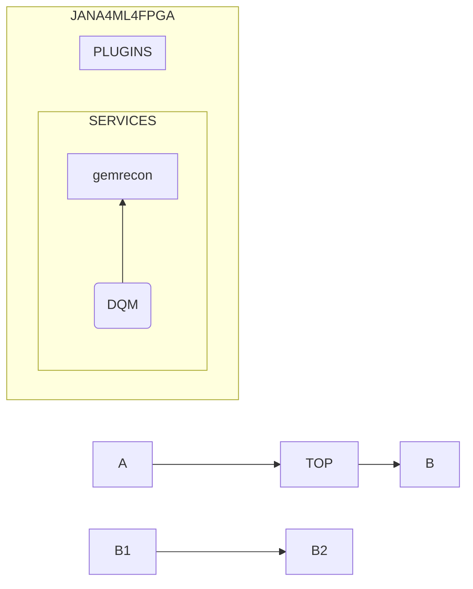

# Data Quality Monitor (DQM)

Data Quality Monitor (DQM) is a tool for data verification, 
detector performance monitoring, data validation, daq system analysis, 
and data processing stages checks. 

This is a brief overview of what DQM goals are:

1. **Data Verification:** The DQM system validates the integrity of the data collected from the detector at different stages of the data acquisition process. It's designed to identify and report any inconsistencies or corruption in the data promptly.

2. **Detector Performance Monitoring:** Our DQM software monitors the performance of the detector in real-time. This feature is crucial for detecting any hardware malfunctions, such as defective sensors or electronic noise, that may compromise the quality of the data.

3. **Data Validation:** The DQM system provides preliminary validation of the data recorded by the detector. By examining the distribution of specific quantities and identifying particular particle signatures, our DQM software ensures that the detector is accurately recording the physics events.

4. **Trigger System Monitoring:** In nuclear physics experiments, a trigger system is employed to select interesting events and discard the uninteresting ones. Our DQM software monitors the performance of this system, ensuring it is neither missing important events nor selecting too many insignificant ones.

5. **Monitoring of Data Processing:** The DQM system also oversees the data processing pipeline. It checks the output at different stages of processing and identifies any potential issues such as software bugs, calibration problems, or unexpected results.

