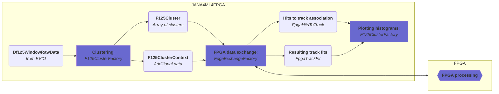
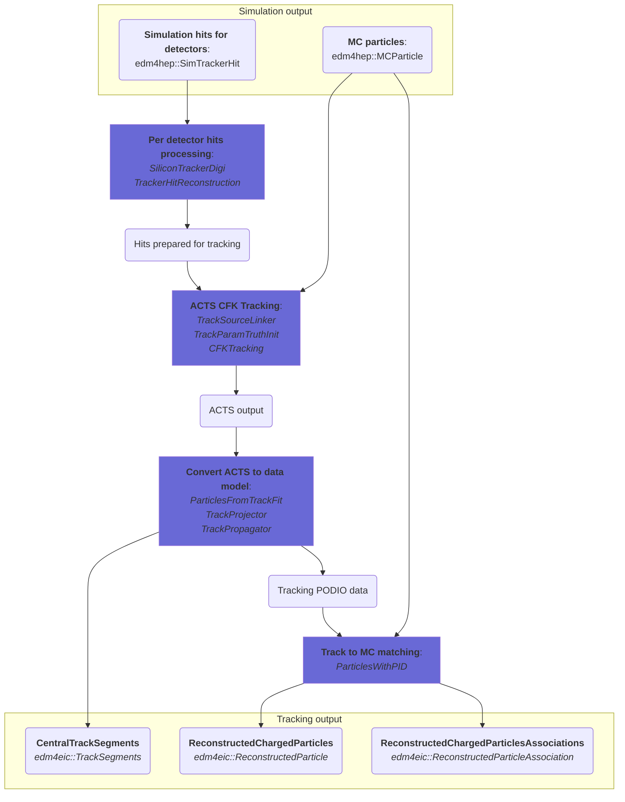

# FPGA connection and exchange

```mermaid
flowchart LR
    classDef alg fill:#44cc;
    classDef col fill:#cc66ff;
  
    subgraph JANA4ML4FPGA
        direction TB
        Df125WindowRawData(<strong>Df125WindowRawData</strong><br/><i>from EVIO</i>)
        Df125WindowRawData --> F125ClusterFactory[<strong>Clustering</strong>:<br/><i>F125ClusterFactory</i>]:::alg
        F125ClusterFactory --> F125Cluster(<strong>F125Cluster</strong><br/><i>Array of clusters</a>)
        F125ClusterFactory --> F125ClusterContext(<strong>F125ClusterContext</strong><br/><i>Additional data</i>)
    
        F125Cluster --> FpgaExchangeFactory[<strong>FPGA data exchange</strong>:<br/><i>FpgaExchangeFactory</i>]:::alg
        F125ClusterContext --> FpgaExchangeFactory
    
        FpgaExchangeFactory --> FpgaHitsToTrack(<strong>Hits to track association</strong><br/><i>FpgaHitsToTrack</i>)
        FpgaExchangeFactory --> FpgaTrackFit(<strong>Resulting track fits</strong><br/><i>FpgaTrackFit</i>)
    
        FpgaHitsToTrack --> FpgaDqmProcessor[<strong>Plotting histograms</strong>:<br/><i>F125ClusterFactory</i>]:::alg
        FpgaTrackFit --> FpgaDqmProcessor        

    end

    subgraph FPGA
        direction TB
        FPGAProcessor{{<strong>FPGA processing</strong>}}:::alg
    end

    FpgaExchangeFactory <----> FPGA


```

```mermaid
flowchart TB
  classDef alg fill:#44cc;
  classDef col fill:#cc66ff;
  subgraph Simulation output
    direction LR
    SimHits(<strong>Simulation hits for detectors</strong>:<br/>edm4hep::SimTrackerHit)
    MCParticles(<strong>MC particles</strong>:<br/>edm4hep::MCParticle)
  end

  SimHits --> HitsReco[<strong>Per detector hits processing</strong>:<br/><i>SiliconTrackerDigi</i><br><i>TrackerHitReconstruction</i>]:::alg
  HitsReco --> Hits(Hits prepared for tracking)

  Hits --> CKFTracking[<strong>ACTS CFK Tracking</strong>:<br/><i>TrackSourceLinker</i><br><i>TrackParamTruthInit</i><br><i>CFKTracking</i>]:::alg
  MCParticles --> CKFTracking

  CKFTracking --> ACTSOutput(ACTS output)

  ACTSOutput --> ACTSToModel[<strong>Convert ACTS to data model</strong>:<br/><i>ParticlesFromTrackFit</i><br><i>TrackProjector</i><br><i>TrackPropagator</i>]:::alg

  ACTSToModel --> TrackingModel(Tracking PODIO data)

  TrackingModel --> ParticlesWithPID:::alg
  MCParticles --> ParticlesWithPID[<strong>Track to MC matching</strong>:<br/><i>ParticlesWithPID</i>]
  ACTSToModel --> CentralTrackSegments

  ParticlesWithPID --> ReconstructedChargedParticles
  ParticlesWithPID --> ReconstructedChargedParticlesAssociations

  subgraph Tracking output
    direction LR
    CentralTrackSegments(<strong>CentralTrackSegments</strong><br/><i>edm4eic::TrackSegments</i>)
    ReconstructedChargedParticles(<strong>ReconstructedChargedParticles</strong><br/><i>edm4eic::ReconstructedParticle</i>)
    ReconstructedChargedParticlesAssociations(<strong>ReconstructedChargedParticlesAssociations</strong><br/><i>edm4eic::ReconstructedParticleAssociation</i>)
  end
```