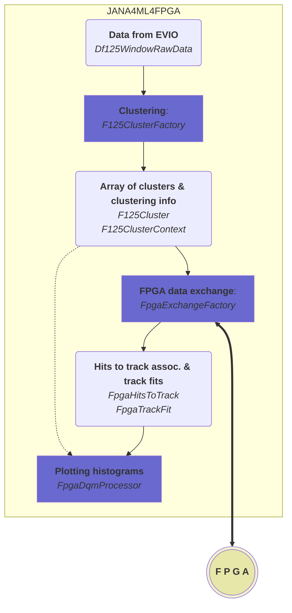

# FPGA connection and exchange




# Run files

On CERN 2024-07 beam tests, file Data 5083

```bash
/home/hdtrdops/DATA/hd_rawdata_005083_000.evio
```

fpga2file.sh

```bash
#!/bin/bash

set -x

jana4ml4fpga \
  -Pplugins=CDAQfile,flat_tree,root_output,dqm,fpgacon \
  -Pjana:nevents=1000 \
  -Pdaq:srs_window_raw:ntsamples=3 \
  -Pjana:debug_plugin_loading=1 \
  -Pfpgacon:port=20250 \
  -Pfpgacon:dedx_threshold=200  \
  -Pjana:timeout=0 \
  -Pdqm:max_event=1  \
  /home/hdtrdops/DATA/hd_rawdata_005083_000.evio
```

daq2file.sh

```bash
#!/bin/bash

set -x

jana4ml4fpga \
  -Pplugins=cdaq,flat_tree,root_output,print_evio \
  -Pjana:nevents=10000 \
  -Pcdaq:port=20248 \
  -Pjana:timeout=0  \
  -Pdaq:srs_window_raw:ntsamples=3 \
  -Pevio:LogLevel=trace \
  -Pgemrecon:LogLevel=trace \
  -Phistsfile=daq_receive.root \
  tcp-cdaq-evio
```

daq2fpga.sh

```sh
#!/bin/sh

set -x

jana4ml4fpga \
  -Pplugins=cdaq,flat_tree,root_output,dqm,fpgacon \
  -Pjana:nevents=10000 \
  -Pdaq:srs_window_raw:ntsamples=3 \
  -Pcdaq:port=20248 \
  -Pjana:debug_plugin_loading=1 \
  -Pfpgacon:port=20250 \
  -Pfpgacon:dedx_threshold=200  \
  -Pdqm:max_event=1000  \
  -Pjana:timeout=0  \
  -Phistsfile=/home/hdtrdops/romanov/daq_fpga_10k_001.root \
  tcp-cdaq-evio
```
